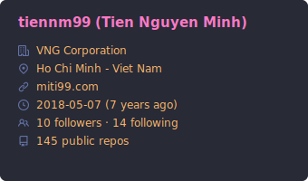
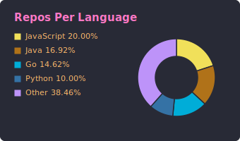
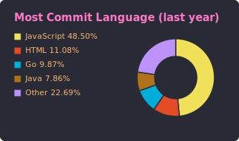
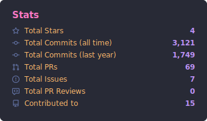
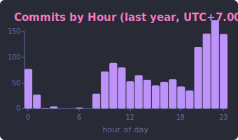
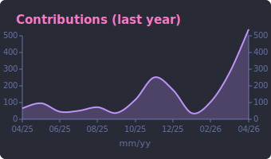
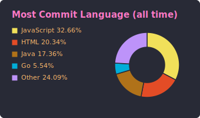
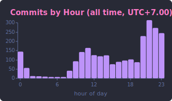
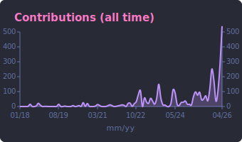

# ghstats

> Generate SVG cards summarizing a GitHub user's profile — written in Go.

[](https://github.com/marketplace/actions/ghstats-cards)
[](https://github.com/tiennm99/ghstats/releases/latest)
[](./LICENSE)

`ghstats` is a single-binary CLI (and a GitHub Action wrapping it) that fetches
data for a GitHub user and writes a themed set of SVGs you can embed in your
profile README.

Marketplace listing: **[ghstats-cards](https://github.com/marketplace/actions/ghstats-cards)** · Source: [`tiennm99/ghstats`](https://github.com/tiennm99/ghstats)

Cards rendered:

| # | Card | What it shows |
| --- | --- | --- |
| 0 | Profile details | Login (Name) title + Octicon-labelled rows for company, location, link, join date (with age), followers/following, public repos |
| 1 | Repos per language | Donut + legend: how many owned non-fork repos use each language as primary |
| 2 | Most commit language (last year) | Donut + legend: last-year commits byte-weighted across each repo's language breakdown |
| 3 | Stats | Star, commit (lifetime + last-year), PR, issue, PR-review, contributed-to totals |
| 4 | Productive time (last year) | 24-hour bar chart with axes, title includes `UTC±N.NN` |
| 5 | Contributions (last year) | Smooth monthly area chart, Y-axis mirrored both sides, `mm/yy` labels |
| 6 | **Most commit language (all time)** | Same as #2 but over lifetime commits |
| 7 | **Productive time (all time)** | Same as #4 but over lifetime commits |
| 8 | **Contributions (all time)** | Area chart across every active year, auto-thinned x-axis labels |

Live `dracula` sample ships in [`output/dracula/`](./output/dracula). Every available theme rendered against the author's profile — profile details, stats, language donuts, productive-time, contributions — is browsable in the auto-generated [**demo gallery**](./demo). Regenerated on every push to `main` by [`.github/workflows/demo.yml`](./.github/workflows/demo.yml).

## In the wild

- [**tiennm99/tiennm99**](https://github.com/tiennm99/tiennm99) — author's profile README, refreshed daily via `tiennm99/ghstats@v1`. Two-per-row layout, dracula theme.

## Use as a GitHub Action (recommended)

Drop this in `.github/workflows/ghstats.yml` in your **profile repo** (the one
named after your username):

```yaml
name: ghstats

on:
  schedule:
    - cron: "0 0 * * *" # daily
  workflow_dispatch:

permissions:
  contents: write

jobs:
  cards:
    runs-on: ubuntu-latest
    steps:
      - uses: actions/checkout@v5
      - uses: tiennm99/ghstats@v1
        with:
          user: ${{ github.repository_owner }}
          token: ${{ secrets.GHSTATS_TOKEN }}   # classic PAT with read:user + repo
          themes: dracula,github_dark,tokyonight
          tz: Asia/Saigon
          include_forks: "true"
          include_private: "true"
          commit_changes: "true"
```

Then embed the cards in your `README.md`:

```md









```

### Action inputs

| Input              | Default                          | Description                                                             |
| ------------------ | -------------------------------- | ----------------------------------------------------------------------- |
| `user`             | —                                | GitHub username (required)                                              |
| `token`            | `${{ github.token }}`            | PAT with `read:user` + `repo` for private repo stats                    |
| `out`              | `output`                         | Output directory                                                        |
| `themes`           | `dracula`                        | Comma-separated theme ids, or `all`                                     |
| `tz`               | `UTC`                            | IANA tz for the productive-time card (e.g. `Asia/Saigon`)               |
| `top_repos`        | `0`                              | Optional cap on seed repos probed for commit history (`0` = unlimited)  |
| `commits_per_repo` | `500`                            | Max commits sampled per repo (covers last-year and all-time aggregates) |
| `include_forks`    | `true`                           | Include forked repos in stats and commit probing                        |
| `include_private`  | `true`                           | Include private repos (requires PAT with `repo` scope; silently no-op otherwise) |
| `commit_changes`   | `false`                          | Commit generated cards back to the repo                                 |
| `commit_message`   | `chore: update ghstats cards`    | Commit message                                                          |
| `commit_branch`    | *(current ref)*                  | Target branch for auto-commit                                           |
| `author_name`      | `github-actions[bot]`            | Commit author                                                           |
| `author_email`     | `…@users.noreply.github.com`     | Commit email                                                            |

## Use as a CLI

```sh
go install github.com/tiennm99/ghstats@latest
```

Or build from source:

```sh
git clone https://github.com/tiennm99/ghstats
cd ghstats
go build -o ghstats .
```

Then:

```sh
export GITHUB_TOKEN=ghp_xxx
ghstats -user tiennm99 -themes dracula,github_dark -tz Asia/Saigon -out output
```

| Flag                | Default         | Description                                                            |
| ------------------- | --------------- | ---------------------------------------------------------------------- |
| `-user`             | *(required)*    | GitHub username                                                        |
| `-token`            | `$GITHUB_TOKEN` | Personal access token                                                  |
| `-out`              | `output`        | Output directory (`<out>/<theme>/…svg`)                                |
| `-themes`           | `dracula`       | Comma-separated theme ids, or `all`                                    |
| `-tz`               | `Local`         | IANA timezone for productive-time cards                                |
| `-top-repos`        | `0`             | Optional cap on seed repos probed (`0` = unlimited)                    |
| `-commits-per-repo` | `500`           | Max commits sampled per repo                                           |
| `-include-forks`    | `true`          | Include forked repos in the stats                                      |
| `-include-private`  | `true`          | Include private repos (requires `repo` PAT scope; silently no-op otherwise) |
| `-list-themes`      |                 | Print available theme ids and exit                                     |

## How attribution works

**Repo sampling** uses a seed list built from `contributionsCollection.commitContributionsByRepository`, unioned across every active contribution year. This catches every repo you've committed in — not just your top-starred ones.

**Commit-to-language** is byte-weighted: each commit credits every language in the repo, proportional to linguist's byte share. A commit to a 60% Go / 40% Python repo adds 0.6 to Go and 0.4 to Python, regardless of which file was touched. Caveats:

- Linguist excludes prose (Markdown, AsciiDoc, reST) from byte counts, so heavily-Markdown repos skew toward whatever small code fraction linguist did detect.
- For per-file accuracy, a future `-accurate-languages` mode is planned (per-commit REST + go-enry).

**Cost per run** (current defaults, typical user):
- ~1 profile query + ~1 query per active year + ~50 commit-history pages ≈ **50-70 GraphQL calls**.
- Zero REST calls. Well under the 5000 points/hr budget.

## Themes

Run `ghstats -list-themes` for the full list (65 themes ported from
github-profile-summary-cards). Built-ins include `default`, `dark`, `dracula`,
`github`, `github_dark`, `tokyonight`, `onedark`, `nord_dark`, `nord_bright`,
`gruvbox`, `radical`, `synthwave`, `monokai`, `solarized`, `solarized_dark`,
`transparent`, and more. Preview every one against real profile data in the
[demo gallery](./demo).

## Output

```
output/
  dracula/
    profile-details.svg
    repos-per-language.svg
    most-commit-language.svg
    stats.svg
    productive-time.svg
    contributions.svg
    most-commit-language-all-time.svg
    productive-time-all-time.svg
    contributions-all-time.svg
```

Only the `dracula` theme is tracked in git as a reference sample; other
themes are rebuilt on each run and gitignored.

## Tokens & permissions

The default `${{ github.token }}` can read public user data but will not see
your private-repo commits. For accurate stats, create a **classic** personal
access token with `read:user` and `repo`, save it as a repo secret (e.g.
`GHSTATS_TOKEN`), and pass it via the `token` input. `include_private`
defaults to `true` so those commits are counted automatically once the token
has `repo` scope; pass `include_private: "false"` if you want to keep private
work out of the rendered cards even when the token can see it.

## Credits & inspiration

- [**github-profile-summary-cards**](https://github.com/vn7n24fzkq/github-profile-summary-cards) by [@vn7n24fzkq](https://github.com/vn7n24fzkq) — card layout, chart styles, theme palette, Octicon selection, and output structure.

## License

Apache-2.0 — see [LICENSE](LICENSE).
