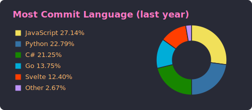
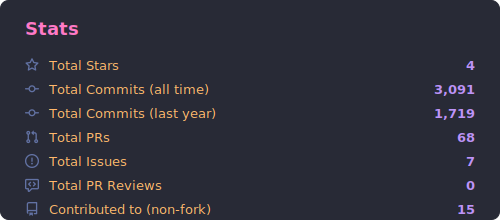

# ghstats

> Generate SVG cards summarizing a GitHub user's profile — written in Go.

`ghstats` is a single-binary CLI (and a GitHub Action wrapping it) that fetches
public data for a GitHub user and writes a themed set of SVGs you can embed in
your profile README:

- Profile details
- Repos per language (how many owned repos use each language as primary)
- Most commit language (last year's commits attributed to each repo's primary language)
- Stats (stars, commits, PRs, issues, PR reviews, contributed-to)
- Productive time heatmap (weekday × hour)

## Use as a GitHub Action (recommended)

Drop this in `.github/workflows/ghstats.yml` in your **profile repo** (the one
named after your username):

```yaml
name: ghstats

on:
  schedule:
    - cron: "0 0 * * *" # daily
  workflow_dispatch:

permissions:
  contents: write

jobs:
  cards:
    runs-on: ubuntu-latest
    steps:
      - uses: actions/checkout@v5
      - uses: tiennm99/ghstats@v1
        with:
          user: ${{ github.repository_owner }}
          token: ${{ secrets.GHSTATS_TOKEN }}   # classic PAT with read:user + repo
          themes: dracula,github_dark,tokyonight
          tz: Asia/Saigon
          commit_changes: "true"
```

Then embed the cards in your `README.md`:

```md





```

### Action inputs

| Input              | Default                          | Description                                              |
| ------------------ | -------------------------------- | -------------------------------------------------------- |
| `user`             | —                                | GitHub username (required)                               |
| `token`            | `${{ github.token }}`            | PAT with `read:user` + `repo` for private repo stats     |
| `out`              | `output`                         | Output directory                                         |
| `themes`           | `dracula`                        | Comma-separated theme ids, or `all`                      |
| `tz`               | `UTC`                            | IANA tz for the productive-time card (e.g. `Asia/Saigon`)|
| `top_repos`        | `10`                             | Owned repos sampled for commit heatmap (`0` to skip)     |
| `commits_per_repo` | `100`                            | Max commits sampled per repo                             |
| `commit_changes`   | `false`                          | Commit generated cards back to the repo                  |
| `commit_message`   | `chore: update ghstats cards`    | Commit message                                           |
| `commit_branch`    | *(current ref)*                  | Target branch for auto-commit                            |
| `author_name`      | `github-actions[bot]`            | Commit author                                            |
| `author_email`     | `…@users.noreply.github.com`     | Commit email                                             |

## Use as a CLI

```sh
go install github.com/tiennm99/ghstats@latest
```

Or build from source:

```sh
git clone https://github.com/tiennm99/ghstats
cd ghstats
go build -o ghstats .
```

Then:

```sh
export GITHUB_TOKEN=ghp_xxx
ghstats -user tiennm99 -themes dracula,github_dark -tz Asia/Saigon -out output
```

| Flag                | Default         | Description                                       |
| ------------------- | --------------- | ------------------------------------------------- |
| `-user`             | *(required)*    | GitHub username                                   |
| `-token`            | `$GITHUB_TOKEN` | Personal access token                             |
| `-out`              | `output`        | Output directory (`<out>/<theme>/…svg`)           |
| `-themes`           | `dracula`       | Comma-separated theme ids, or `all`               |
| `-tz`               | `Local`         | IANA timezone for productive-time heatmap         |
| `-top-repos`        | `10`            | Owned repos sampled for heatmap (`0` to skip)     |
| `-commits-per-repo` | `100`           | Max commits sampled per repo                      |
| `-list-themes`      |                 | Print available theme ids and exit                |

## Themes

Run `ghstats -list-themes` for the full list (60+ themes ported from
github-profile-summary-cards). Built-ins include `default`, `dark`, `dracula`,
`github`, `github_dark`, `tokyonight`, `onedark`, `nord_dark`, `nord_bright`,
`gruvbox`, `radical`, `synthwave`, `monokai`, `solarized`, `solarized_dark`,
`transparent`, and more.

## Output

```
output/
  dracula/
    0-profile-details.svg
    1-repos-per-language.svg
    2-most-commit-language.svg
    3-stats.svg
    4-productive-time.svg
```

## Tokens & permissions

The default `${{ github.token }}` can read public user data but will not see
your private-repo commits. For accurate stats, create a **classic** personal
access token with `read:user` and `repo`, save it as a repo secret (e.g.
`GHSTATS_TOKEN`), and pass it via the `token` input.

## Credits & inspiration

- [**github-profile-summary-cards**](https://github.com/vn7n24fzkq/github-profile-summary-cards) by [@vn7n24fzkq](https://github.com/vn7n24fzkq) — card layout, chart styles, theme palette, Octicon selection, and output structure.

## License

Apache-2.0 — see [LICENSE](LICENSE).
