# ghstats demo gallery

Every card in every theme, rendered for [`tiennm99`](https://github.com/tiennm99).

Auto-generated by [`.github/workflows/demo.yml`](../.github/workflows/demo.yml) on each push to `main`. Do not edit by hand.

## Themes

- [`2077`](#2077)
- [`algolia`](#algolia)
- [`apprentice`](#apprentice)
- [`aura`](#aura)
- [`aura_dark`](#aura_dark)
- [`ayu_mirage`](#ayu_mirage)
- [`bear`](#bear)
- [`blue_green`](#blue_green)
- [`blueberry`](#blueberry)
- [`buefy`](#buefy)
- [`calm`](#calm)
- [`chartreuse_dark`](#chartreuse_dark)
- [`city_lights`](#city_lights)
- [`cobalt`](#cobalt)
- [`cobalt2`](#cobalt2)
- [`codeSTACKr`](#codeSTACKr)
- [`darcula`](#darcula)
- [`dark`](#dark)
- [`date_night`](#date_night)
- [`default`](#default)
- [`discord_old_blurple`](#discord_old_blurple)
- [`dracula`](#dracula)
- [`flag_india`](#flag_india)
- [`github`](#github)
- [`github_dark`](#github_dark)
- [`gotham`](#gotham)
- [`graywhite`](#graywhite)
- [`great_gatsby`](#great_gatsby)
- [`gruvbox`](#gruvbox)
- [`highcontrast`](#highcontrast)
- [`holi`](#holi)
- [`jolly`](#jolly)
- [`kacho_ga`](#kacho_ga)
- [`maroongold`](#maroongold)
- [`material_palenight`](#material_palenight)
- [`merko`](#merko)
- [`midnight_purple`](#midnight_purple)
- [`moltack`](#moltack)
- [`monokai`](#monokai)
- [`moonlight`](#moonlight)
- [`nightowl`](#nightowl)
- [`noctis_minimus`](#noctis_minimus)
- [`nord_bright`](#nord_bright)
- [`nord_dark`](#nord_dark)
- [`ocean_dark`](#ocean_dark)
- [`omni`](#omni)
- [`onedark`](#onedark)
- [`outrun`](#outrun)
- [`panda`](#panda)
- [`prussian`](#prussian)
- [`radical`](#radical)
- [`react`](#react)
- [`rose_pine`](#rose_pine)
- [`shades_of_purple`](#shades_of_purple)
- [`slateorange`](#slateorange)
- [`solarized`](#solarized)
- [`solarized_dark`](#solarized_dark)
- [`swift`](#swift)
- [`synthwave`](#synthwave)
- [`tokyonight`](#tokyonight)
- [`transparent`](#transparent)
- [`vision_friendly_dark`](#vision_friendly_dark)
- [`vue`](#vue)
- [`yeblu`](#yeblu)
- [`zenburn`](#zenburn)

## 2077

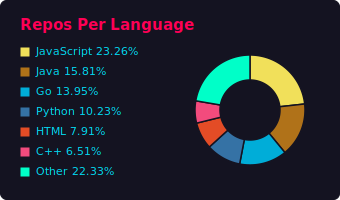
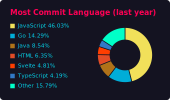
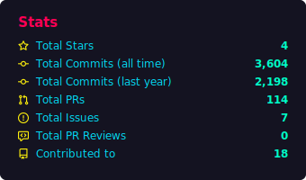
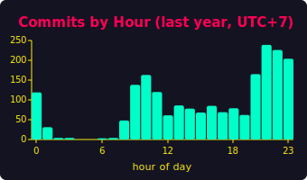
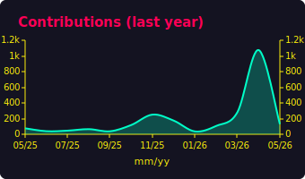
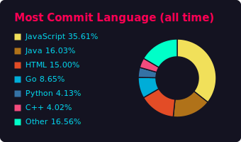
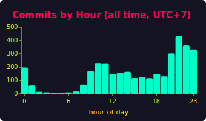
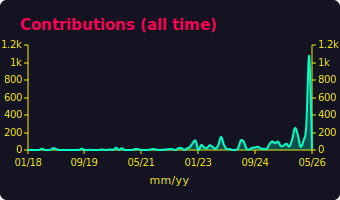

[back to top](#themes)

## algolia

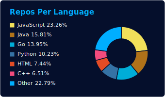
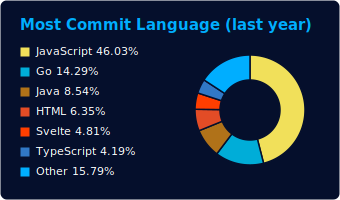
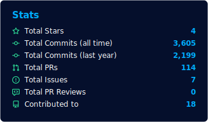
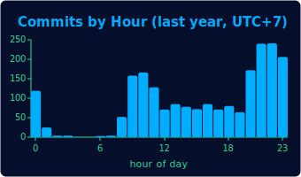
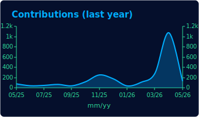
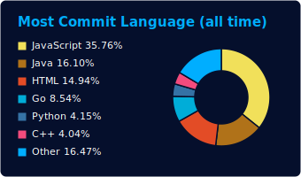
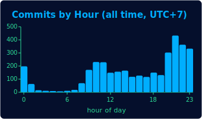
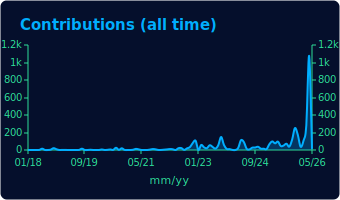

[back to top](#themes)

## apprentice

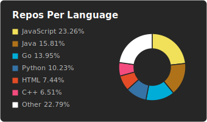
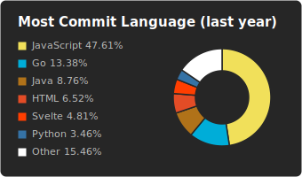
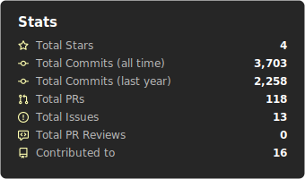
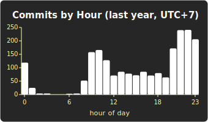
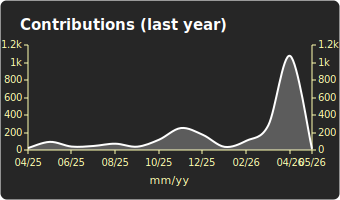
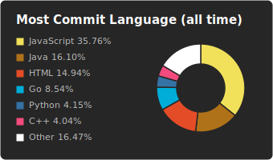
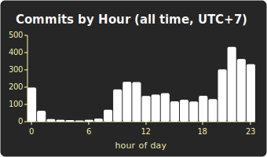
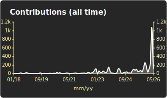

[back to top](#themes)

## aura

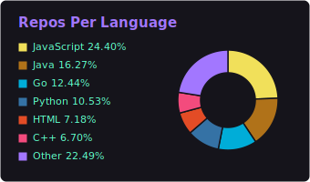
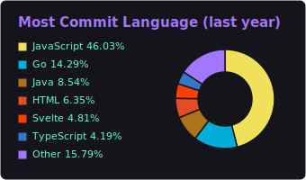
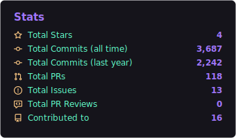
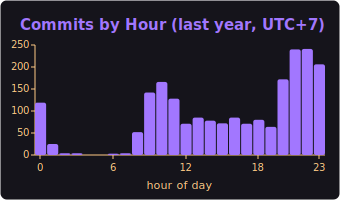
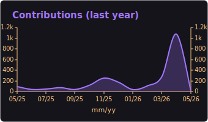
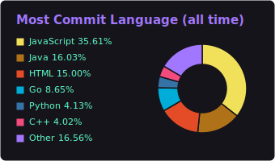
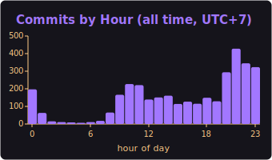
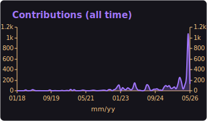

[back to top](#themes)

## aura_dark

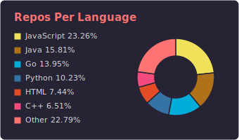

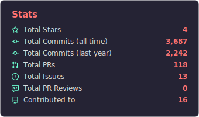
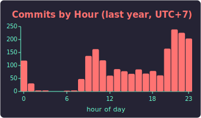
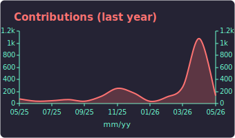
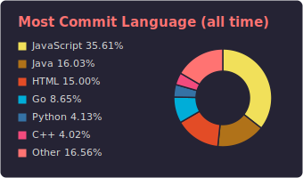
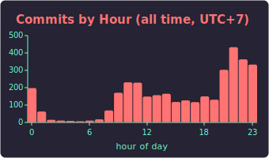
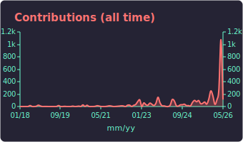

[back to top](#themes)

## ayu_mirage

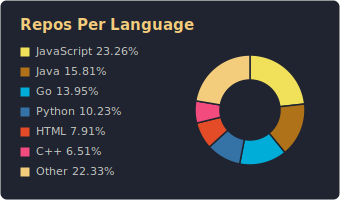
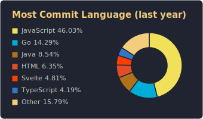
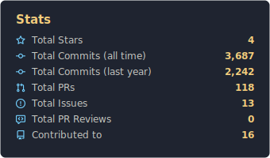
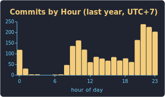
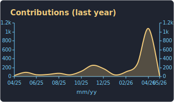
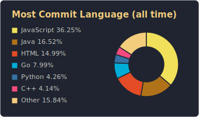
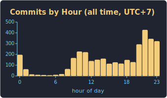

[back to top](#themes)

## bear

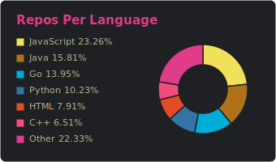
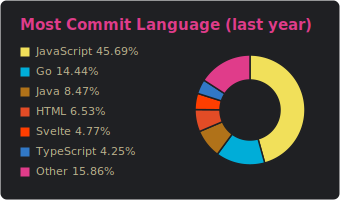
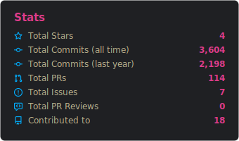
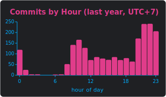

[back to top](#themes)

## blue_green

[back to top](#themes)

## blueberry

[back to top](#themes)

## buefy

[back to top](#themes)

## calm

[back to top](#themes)

## chartreuse_dark

[back to top](#themes)

## city_lights

[back to top](#themes)

## cobalt

[back to top](#themes)

## cobalt2

[back to top](#themes)

## codeSTACKr

[back to top](#themes)

## darcula

[back to top](#themes)

## dark

[back to top](#themes)

## date_night

[back to top](#themes)

## default

[back to top](#themes)

## discord_old_blurple

[back to top](#themes)

## dracula

[back to top](#themes)

## flag_india

[back to top](#themes)

## github

[back to top](#themes)

## github_dark

[back to top](#themes)

## gotham

[back to top](#themes)

## graywhite

[back to top](#themes)

## great_gatsby

[back to top](#themes)

## gruvbox

[back to top](#themes)

## highcontrast

[back to top](#themes)

## holi

[back to top](#themes)

## jolly

[back to top](#themes)

## kacho_ga

[back to top](#themes)

## maroongold

[back to top](#themes)

## material_palenight

[back to top](#themes)

## merko

[back to top](#themes)

## midnight_purple

[back to top](#themes)

## moltack

[back to top](#themes)

## monokai

[back to top](#themes)

## moonlight

[back to top](#themes)

## nightowl

[back to top](#themes)

## noctis_minimus

[back to top](#themes)

## nord_bright

[back to top](#themes)

## nord_dark

[back to top](#themes)

## ocean_dark

[back to top](#themes)

## omni

[back to top](#themes)

## onedark

[back to top](#themes)

## outrun

[back to top](#themes)

## panda

[back to top](#themes)

## prussian

[back to top](#themes)

## radical

[back to top](#themes)

## react

[back to top](#themes)

## rose_pine

[back to top](#themes)

## shades_of_purple

[back to top](#themes)

## slateorange

[back to top](#themes)

## solarized

[back to top](#themes)

## solarized_dark

[back to top](#themes)

## swift

[back to top](#themes)

## synthwave

[back to top](#themes)

## tokyonight

[back to top](#themes)

## transparent

[back to top](#themes)

## vision_friendly_dark

[back to top](#themes)

## vue

[back to top](#themes)

## yeblu

[back to top](#themes)

## zenburn

[back to top](#themes)

